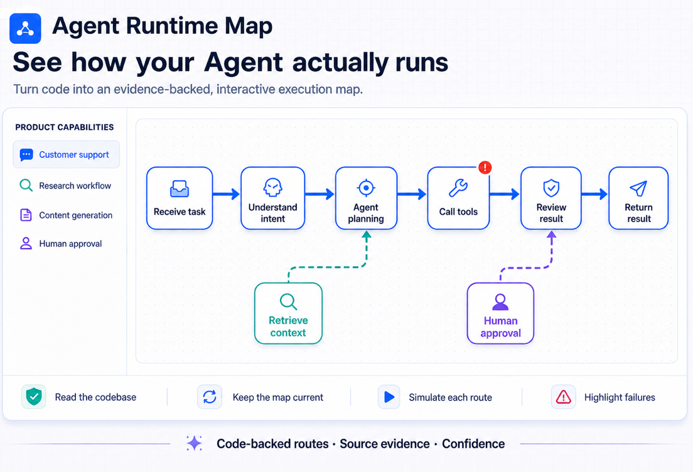
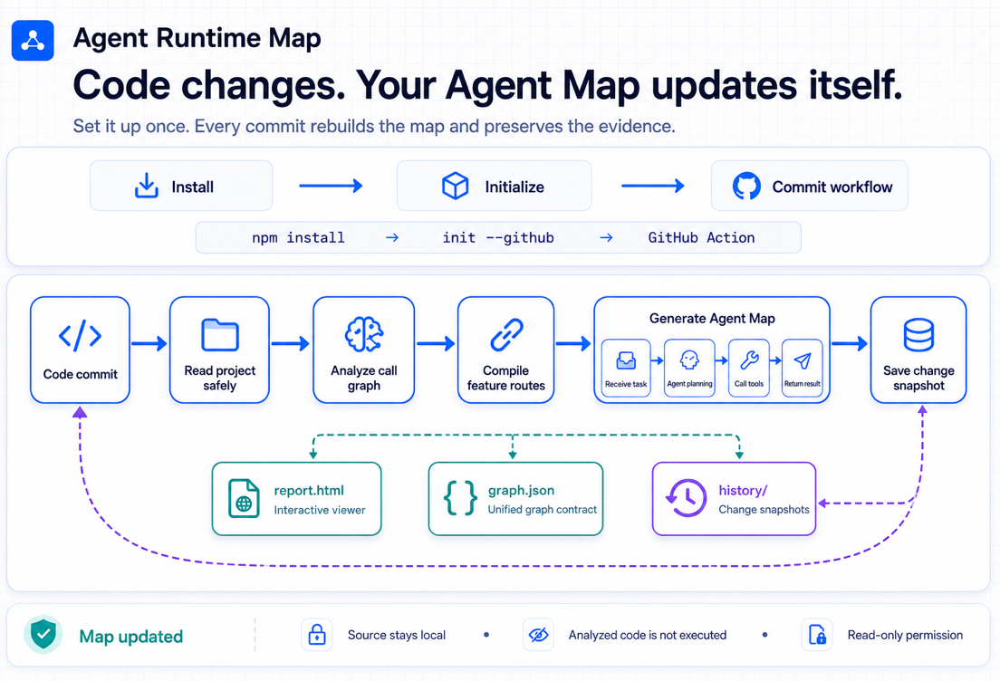
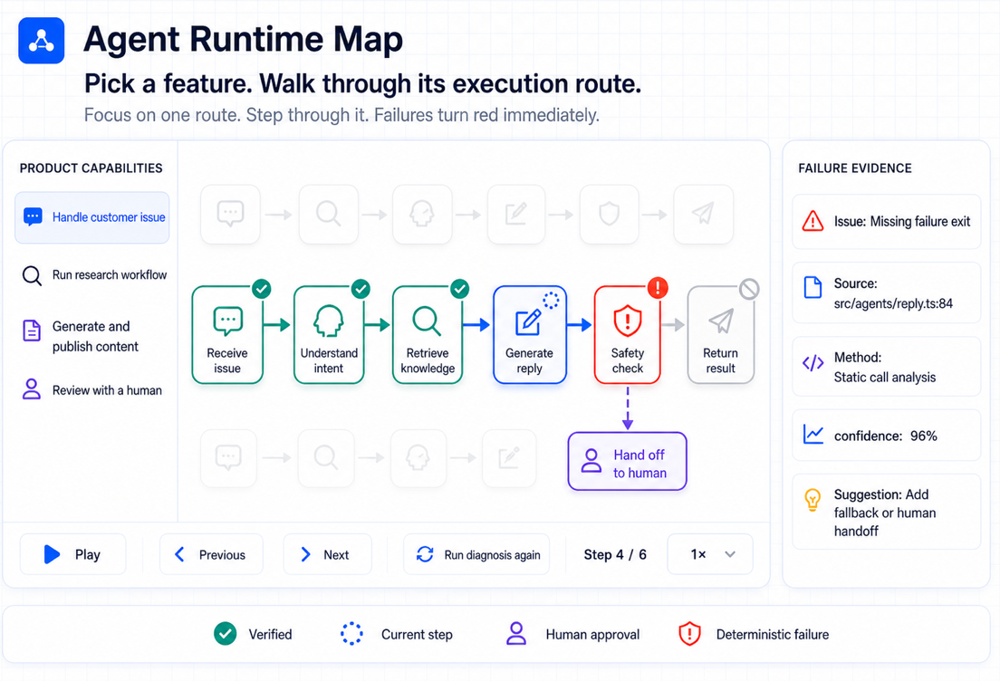

# Agent Runtime Map

[简体中文](README.zh-CN.md) · English

<p align="center">
  
</p>

Turn your Agent codebase into an evidence-backed circuit map you can inspect step by step.

Agent Runtime Map reads a TypeScript, JavaScript, or Python repository together with its README, selected docs/PRD files, prompts, package metadata, and safe configuration. It extracts routes, calls, workflows, agents, tools, models, database operations, external services, and control flow, then compiles them into one global execution graph. A feature list on the left lets you play, pause, step through, replay, and switch between the inferred routes for each Agent capability.

> Status: **0.1 alpha**. The supported scope is intentionally narrow and documented below. Agent Runtime Map does not claim to understand every codebase.

## See it before you read it

<p align="center">
  
</p>

<p align="center">
  
</p>

## Grounded, not authored

Diagram skills that ask an LLM to read a repository and *author* a map can
produce a beautiful picture of what the model believed; their validation checks
that the picture is well-formed, not that it matches the code. Agent Runtime Map
takes the opposite contract: **a deterministic analyzer builds the topology**,
so the map cannot contain a connection the code does not have, the same commit
always produces the same graph, and every node and edge keeps the `file:line`
evidence, inference method, and confidence score that produced it. The optional
LLM layer may rename and describe — it is structurally unable to add a node or
an edge.

## What it produces

```text
Existing codebase
      ↓
Project Reader + TypeScript AST + framework conventions
      ↓
Docs / prompts / dependencies + code facts
      ↓
Raw Code Graph (code facts)
      ↓
Logic Compiler (feature understanding + compression)
      ↓ optional, explicit opt-in
Evidence-constrained semantic enrichment
      ↓
Logic Graph (human-scale flow)
      ↓
ELK layout + React Flow viewer
```

Every visible node includes source files, line numbers, an inference explanation, and a confidence score. Code remains the source of truth; uncertain conclusions are marked instead of silently presented as facts.

## Project understanding

The Project Reader safely gathers high-signal context before compilation:

- `package.json`, framework dependencies, scripts, and package manager;
- README, selected files under `docs/`, PRD documents, and prompt directories;
- inline prompt/instructions constants and Agent SDK configuration;
- optional `agent-runtime-map.config.json` product descriptions and feature hints.

Sensitive files such as `.env`, credentials, private keys, build output,
`node_modules`, and VCS metadata are never read as semantic context. The analyzer
does not execute the inspected project or its configuration.

The TypeScript adapter distinguishes Agents, workflows, tools, models, prompts,
human approval gates, data, and external systems. It records sequential,
conditional, parallel, loop, retry, fallback, and human-approval relationships.
OpenAI Agents SDK-style definitions and LangGraph-style declarative topology have
dedicated detection in addition to general TypeScript call analysis.

## Feature circuit inspector

- **One global Agent graph:** shared workflows, agents, tools, databases, and external APIs remain visible in a single circuit diagram.
- **One route per feature:** select a capability such as Generate, Review, or Import to isolate the nodes and edges that implement it.
- **Static simulation:** play, pause, advance one step, replay, choose a branch, and change playback speed. This simulates the code-backed execution model; it does not pretend that a live request is running.
- **Chain Doctor:** verified steps turn green, uncertain inference turns yellow, and deterministic problems turn red and stop the inspection at the failing step.
- **Evidence-first diagnostics:** errors retain source files, lines, confidence, cause, and a suggested repair.
- **Semantic zoom:** scrolling smoothly crossfades between the whole system, Agent logic, and exact source-evidence layers without deleting graph facts or flickering at level boundaries.
- **Inspectable code internals:** double-click a logic node to reveal a bounded local subgraph of the real Agents, functions, tools, and calls that support it—without disturbing the global map.
- **Source-linked map:** click a node or search result to read its local, line-highlighted source evidence. The Viewer exposes only analyzed source paths, never arbitrary local files.
- **Calm navigation:** search flies to a result, playback can follow the active step until the user touches the map, and dragged nodes keep their project-local positions with undo and reset.
- **Chinese and English:** the CLI and Viewer follow the operating-system/browser locale automatically and include explicit overrides.

## Blueprint viewer and reusable components

The Viewer uses an open engineering-blueprint visual system: a fine grid canvas,
icon-first nodes, labeled solid/dashed system boundaries, blue orthogonal main
flows, and dashed auxiliary data links. Playback is part of the same visual
language: the current step scans blue, verified steps turn green, uncertain
steps turn amber, and a deterministic failure turns the affected circuit red.

The visual primitives live in the separate open-source
[`@agent-runtime-map/react`](packages/react/README.md) workspace package instead
of being locked inside the Viewer. It exports React Flow node components, group
frames, edge-state tokens, and boundary measurement helpers for embedding the
same map in another product. See [Visual Components](docs/VISUAL_COMPONENTS.md)
for the component contract and integration example.

## Set it up once, GitHub keeps the map current

The primary way to use Agent Runtime Map: install it, run one init, commit the
workflow it generates — and from then on every push and pull request rebuilds the
map on GitHub automatically.

```bash
npm install --save-dev agent-runtime-map
npx agent-runtime-map init --github
git add agent-runtime-map.config.json .github/workflows/agent-runtime-map.yml
git commit -m "Add Agent Runtime Map"
```

(No registry access? The same CI-validated package is attached to every
[GitHub Release](https://github.com/TheCrazyAnt/agent-runtime-map/releases)
as a direct-install tarball.)

**Runner requirement.** The action runs on Node 24, which needs Actions Runner
2.327.1 or newer. GitHub-hosted runners are already there and need nothing.
A **self-hosted** runner pinned below that must be updated first, or the action
fails at its first step.

That's the whole setup. Afterwards:

- **Every push and PR** re-analyzes the repository and rebuilds the map; a weekly
  scheduled run picks up compatible analyzer improvements even when nobody pushes.
- **The run's Step Summary** shows the map's status, what changed (nodes, flows,
  features), which features were affected, new or resolved diagnostics, and which
  files triggered the update.
- **The full map** — including the standalone interactive `report.html` — is
  attached to the run as a private artifact. Nothing is committed to your branch,
  and nothing is published anywhere public by default.
- **Your own backend** can keep embedding the same artifacts; see
  [examples/nextjs-embed](examples/nextjs-embed/README.md) and
  [examples/report-embed](examples/report-embed/README.md).

The generated workflow references `TheCrazyAnt/agent-runtime-map@v1`: `v1`
receives backward-compatible features and fixes only, so the map improves without
you editing the workflow — breaking changes ship as `v2`, and the exact tool
version behind every build is recorded in its `manifest.json` and `status.json`.
Organizations with strict supply-chain requirements can pin the action to a full
commit SHA instead, at the cost of automatic updates. The action uses only
official `actions/*` building blocks, needs nothing beyond `contents: read`,
never executes the analyzed project, and uploads no source, environment
variables, or secrets — the artifact is verified to contain only the map before
upload. An explicit `publish: pages` input exists for teams who want a public
map, with a loud warning: the map exposes internal logic.

## Local development: watch mode

While actively editing, a local watcher is faster than waiting for CI:

```bash
npx agent-runtime-map init      # if you haven't already
npx agent-runtime-map watch .
```

- `watch .` builds the map, opens the Viewer, and keeps both current: every
  change to source, README, docs, PRD, prompts, or configuration triggers a
  debounced re-analysis, and the open Viewer refreshes itself.
- `build .` produces the same artifacts once, without a watcher.

Every build maintains `.agent-runtime-map/`:

```text
.agent-runtime-map/
  current/
    graph.json       the Logic Graph (what every embedding consumes)
    raw-graph.json   detailed code facts
    manifest.json    buildId + file index; polling this is how views stay live
    status.json      updated | stale | failed, with the reason and timestamps
    changes.json     added/removed/modified nodes, edges, features; affected
                     features; appeared/resolved diagnostics; triggering files
    report.html      standalone interactive viewer over the embedded graph
  history/<timestamp>/   one snapshot per successful build
```

A failed analysis never clears `current/`: the last successful map stays in place
and `status.json` says `failed`, why, and when. A new map is staged and promoted
atomically, so an interrupted build can leave a stale map but never a torn one.

To try the analyzer without installing anything, from this repository:

```bash
npm ci
npm run build
node packages/cli/dist/cli.js examples/simple-agent --no-open
```

## CLI

```text
agent-runtime-map init [project]               Create agent-runtime-map.config.json
agent-runtime-map init --github [project]      Also generate the GitHub Actions workflow (--force to overwrite your edits)
agent-runtime-map build [project]              Build the continuous map into .agent-runtime-map/current/
agent-runtime-map watch [project]              Watch, rebuild on change, and serve the live viewer
agent-runtime-map [project] [options]          One-shot: analyze and open the interactive viewer
agent-runtime-map serve [project] [options]    One-shot: analyze and open the interactive viewer
agent-runtime-map analyze [project] [options]  One-shot: generate JSON and exit
```

The shorter `logic-map` command remains available as a compatibility alias.

Common options:

```text
--max-files <number>     Source-file analysis limit (default: 2000)
--max-context-files <number> Project-document limit (default: 80)
--max-context-bytes <number> Project-context byte limit (default: 750000)
--no-context             Skip README/docs/PRD/prompt reading
--max-nodes <number>     Compiled logic-node limit (default: 40)
--graph-type <type>      runtime_logic or product_logic
--description <text>     Optional product context
--locale <locale>        auto, zh-CN, or en (default: auto)
--port <number>          Local viewer port (default: 4173)
--host <host>            Local viewer host (default: 127.0.0.1)
--no-open                Do not open a browser automatically
--no-raw                 Do not write the detailed Raw Code Graph
--semantic openai        Explicitly enable optional LLM semantic compression
--semantic-model <name>  Required model name for semantic mode
```

Generated artifacts are stored under `.logic-map/`:

- `graph.json` is the viewer-facing Logic Graph.
- `raw-graph.json` contains detailed code facts and relationships.

## Language

Agent Runtime Map follows the user's environment automatically: Chinese systems
and browsers use Chinese, while other locales use English. Use `--locale zh-CN`
or `--locale en` to override detection. The Viewer also includes a language
switch. Source symbols and file evidence always retain their original spelling.

## Current support

- TypeScript, TSX, JavaScript, and JSX
- Python, through a separate adapter that produces the same graph
- `tsconfig.json` and `jsconfig.json` path aliases
- Next.js App Router route handlers
- Express/Hono-style route registration
- Functions, methods, imports, statically resolvable calls, and result data flow
- README/docs/PRD/prompt ingestion and documented feature matching
- Agent, workflow, tool, model, prompt, human-gate, action, and service conventions
- OpenAI Agents SDK-style configuration and LangGraph-style declarative graphs
- FastAPI/Flask route decorators and Python Agent constructions
- Conditional, parallel, loop, bounded/unbounded retry, fallback, and human-approval edges
- Common Prisma-like database operations
- Literal Fetch/Axios external URLs and selected SDK calls
- Global Agent circuit with per-feature route selection and branch variants
- Static chain simulation with play, pause, step, replay, and speed controls
- Chain Doctor diagnostics with healthy, warning, and error states
- Local interactive viewer with ELK layout, search, minimap, confidence, and source evidence

Known limits:

- Dynamic dispatch and runtime-only dependency injection may be omitted.
- Product logic mode combines deterministic code analysis with available project documents, prompts, and explicit configuration, but dynamic runtime-only behavior may still be omitted.
- Optional LLM enrichment is label/description-only: it cannot create nodes, edges, files, or evidence. It requires explicit CLI opt-in, an explicit model, and `OPENAI_API_KEY`.
- Python and actual runtime tracing are not part of 0.1. The current playback is an explicit simulation of the statically inferred chain.

## Privacy and network behavior

Analysis runs locally by default. Agent Runtime Map does not upload source code, invoke an LLM, or add telemetry unless `--semantic openai` is explicitly enabled. Semantic mode sends a bounded evidence snapshot—not the absolute project root or raw source files—uses Structured Outputs, requests `store: false`, and only accepts patches for IDs already present in the deterministic graph. The viewer binds to `127.0.0.1` by default. If you deliberately use `--host 0.0.0.0`, graph data and source paths become reachable from your network.

See [Project Context and Semantic Analysis](docs/PROJECT_CONTEXT.md) before enabling any network-backed semantic provider.

## Repository layout

```text
apps/viewer                 React Flow + ELK interactive viewer
packages/react              Reusable blueprint React Flow components and styles
packages/schema             Raw Code Graph and Logic Graph protocol
packages/project-reader     Safe README/docs/PRD/prompt and manifest reader
adapters/typescript         TypeScript/JavaScript static analyzer
adapters/python             Python static analyzer, same Raw Code Graph
packages/analysis-kit       Classification and evidence rules shared by adapters
packages/logic-compiler     Human-scale graph compiler
packages/semantic           Optional evidence-constrained semantic enrichment
packages/core               Analysis and output orchestration
packages/cli                Public, bundled agent-runtime-map npm package
examples/simple-agent       End-to-end example project
tests                       Analyzer and viewer-server tests
```

More detail is available in [Architecture](docs/ARCHITECTURE.md), [Graph Schema](docs/GRAPH_SCHEMA.md), [Project Context](docs/PROJECT_CONTEXT.md), [Visual Components](docs/VISUAL_COMPONENTS.md), the [Roadmap](docs/ROADMAP.md), and [Third-Party Notices](THIRD_PARTY_NOTICES.md).
For implementation continuation, see the detailed [CC handoff guide](docs/CC_HANDOFF.md).

## Releasing

npm releases go through npm Trusted Publishing (OIDC) — no tokens anywhere. A
version tag or explicit manual dispatch is the only way anything publishes, and
already-published versions are always skipped. See
[docs/RELEASING.md](docs/RELEASING.md).

## Development

```bash
npm ci
npm run typecheck
npm test
npm run build
npm run release:check
```

See [CONTRIBUTING.md](CONTRIBUTING.md) before proposing analyzers or semantic rules. New inference rules must include evidence and confidence behavior.

## Optional Agent Integrations

These are side doors, not the main path: the product is the continuously updated
map above. They exist so an agent can consume the same evidence-backed graph.

**Agent skill** (Claude Code, Cursor, Codex CLI, OpenCode):

```bash
npx skills add TheCrazyAnt/agent-runtime-map -g
```

The skill runs the release CLI, reads the generated Logic Graph, and answers with
`file:line` evidence and confidence — it never authors topology of its own. See
[skills/agent-runtime-map/SKILL.md](skills/agent-runtime-map/SKILL.md).

**MCP server** — for hosts that speak the Model Context Protocol:

```json
{
  "mcpServers": {
    "agent-runtime-map": {
      "command": "node",
      "args": ["/absolute/path/to/agent-runtime-map/packages/mcp/dist/index.js"]
    }
  }
}
```

Four tools — `analyze_project`, `list_features`, `describe_feature`, `get_evidence` —
each answering one question and naming the tool that answers the next. Every answer
keeps the source location and confidence behind each step. See
[packages/mcp](packages/mcp/README.md).

Without an agent, `agent-runtime-map analyze .` writes a graph for anything that can
read JSON.

## License

MIT © Agent Runtime Map contributors.
