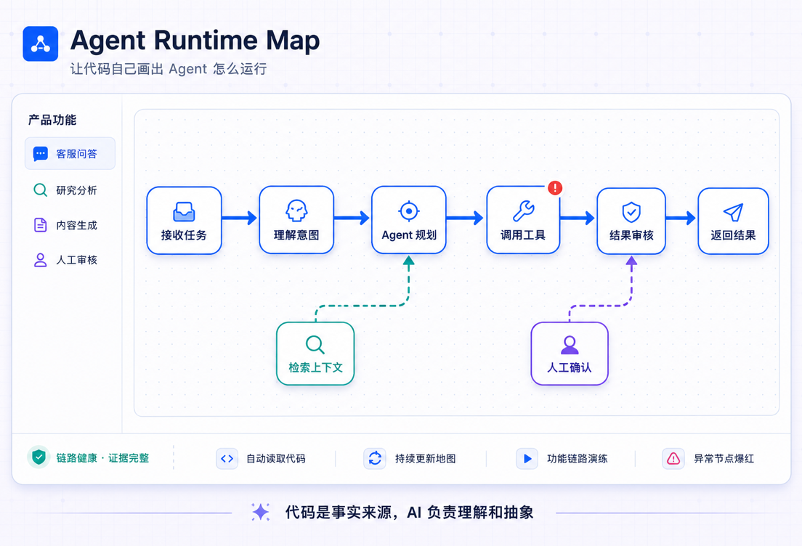
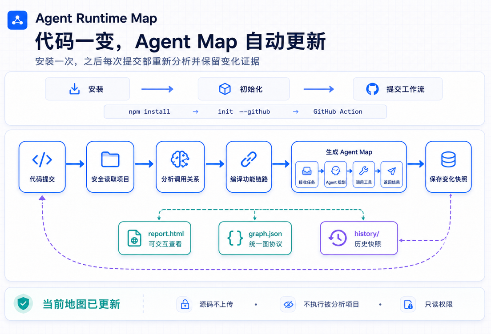
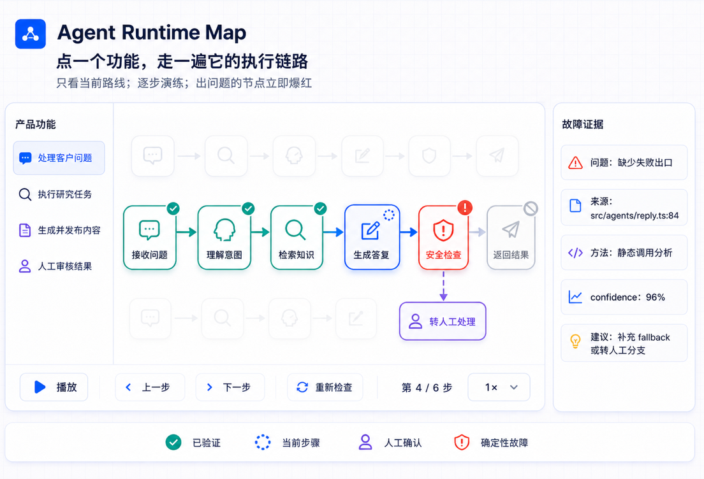

# Agent Runtime Map

简体中文 · [English](README.md)

<p align="center">
  
</p>

让 Agent 代码自己画出它的功能电路，并逐步检查每一条执行链路。

Agent Runtime Map 会读取 TypeScript / JavaScript / Python 项目，同时理解 README、docs/PRD、Prompt、依赖和安全配置；再通过 AST 与框架规则提取页面操作、API、工作流、Agent、工具、模型、数据库、外部服务与控制流，最后编译成一张全局 Agent 执行图。

左侧是项目的全部功能。点击某个功能，就能在右侧全局图上播放、暂停、单步前进、重新检查、调整速度，并切换该功能的不同执行分支。

> 当前为 **0.1 alpha**。支持范围是刻意收窄的，不会声称能理解所有代码项目。

## 先看图，再看说明

<p align="center">
  
</p>

<p align="center">
  
</p>

## 图是提取出来的，不是"写作"出来的

让 LLM 读一遍仓库、然后"写"出一张架构图的技能，画出来的是模型当时的理解；
它们的校验只保证图**自洽**，不保证图**符合代码**。Agent Runtime Map 走的是相反
的契约：**拓扑由确定性分析器构建**——图里不可能出现代码中不存在的连线，同一个
commit 永远生成同一张图，每个节点和连线都保留产生它的 `文件:行号` 证据、推断
方法与置信度。可选的 LLM 层只能改名和补描述，在结构上没有能力新增任何节点或
连线。

## 它解决什么问题

- **一张全局电路图：** 共享的工作流、Agent、工具、数据库和外部 API 保留在同一张图中。
- **每个功能一条路线：** 选择“生成、审核、导入”等功能，只高亮实现它的节点与连线。
- **静态链路模拟：** 播放器模拟代码推断出的执行路线，不会假装真的有一个线上请求正在运行。
- **链路检查：** 已确认步骤变绿；不确定推断变黄；确定性断链变红，并在出错步骤停止。
- **源码证据：** 每个节点和诊断都保留文件、行号、置信度、识别方法与修复建议。
- **语义缩放：** 滚轮缩放会在全局、Agent 逻辑和源码证据三层间连续渐变，不删除图里的事实，也不会在层级边界来回闪烁。
- **可展开的代码细节：** 双击逻辑节点会在它附近展开真实的 Agent、函数、工具与调用关系，不重新打乱全局图。
- **源码联动：** 点击节点或搜索结果即可读取本地、带行号高亮的源码证据；Viewer 只允许读取已分析图中出现过的文件。
- **平滑导航：** 搜索会飞到命中节点；播放可跟随当前步骤，用户拖动画布后立即让出控制；拖动节点的位置会按项目记忆，并支持撤销和重置。
- **自动中英文：** 中文系统和浏览器默认显示中文，海外环境默认显示英文，也可以手动切换。

## 项目理解能力

- 读取 `package.json`、框架依赖、脚本与包管理器。
- 读取 README、`docs/`、PRD、Prompt 文件和代码内的 instructions。
- 识别 Agent、Workflow、Tool、Model、Prompt、人工审批、数据库和外部系统。
- 识别顺序、条件、并行、循环、重试、fallback 与人工确认链路。
- 支持 OpenAI Agents SDK 风格配置与 LangGraph 风格声明式拓扑。
- 支持 `agent-runtime-map.config.json` 补充产品说明、功能名称与关键词。

Project Reader 不会把 `.env`、凭据、私钥、`node_modules`、构建产物或 Git
元数据作为语义上下文，也不会执行被分析项目及其配置文件。

## 蓝图 Viewer 与可复用组件

Viewer 采用开源的工程蓝图视觉系统：细密网格画布、图标型节点、带标题的
实线/虚线分区、蓝色直角主链路，以及灰色虚线数据链路。播放状态直接作用于
这张图：当前步骤蓝色扫描，已验证步骤变绿，不确定步骤变黄，确定性故障则让
对应节点和链路爆红。

这些 UI 不只存在于 Viewer 内部，而是独立放在开源的
[`@agent-runtime-map/react`](packages/react/README.md) 工作区包中。其他 Agent
后台可以复用节点、分区边框、链路状态 token 和自动边界计算工具。组件接口和
嵌入示例见 [Visual Components](docs/VISUAL_COMPONENTS.md)。

## 一次设置，GitHub 持续更新（主路径）

主用法：安装、执行一次 init、提交它生成的 workflow——之后每次 push 和 Pull
Request 都会在 GitHub 上自动重建地图。

```bash
npm install --save-dev agent-runtime-map
npx agent-runtime-map init --github
git add agent-runtime-map.config.json .github/workflows/agent-runtime-map.yml
git commit -m "Add Agent Runtime Map"
```

（无法访问 npm registry？每个
[GitHub Release](https://github.com/TheCrazyAnt/agent-runtime-map/releases)
都附有同一个通过 CI 校验的安装包，可直接以 tarball 地址安装。）

**运行环境要求。** 本 Action 运行在 Node 24 上，需要 Actions Runner 2.327.1 或更高
版本。**GitHub 托管的 runner** 已满足，无需任何操作；**自建 runner** 若固定在更低
版本，需先升级，否则 Action 会在第一步就失败。

设置到此为止。之后：

- **每次 push 和 PR** 自动重新分析并重建地图；每周一次的定时任务保证即使近期
  没有提交，发布的兼容改进也会让仓库自动重建一次。
- **运行的 Step Summary** 显示地图状态、节点/边/功能的增删改、受影响的功能、
  新增或消失的诊断，以及触发本次更新的文件。
- **完整地图**（含独立交互式 `report.html`）作为私有 artifact 附在运行结果里。
  不会向你的分支提交任何内容，默认也不会公开发布到任何地方。
- **自己的后台**照常嵌入同一套产物：见
  [examples/nextjs-embed](examples/nextjs-embed/README.md) 和
  [examples/report-embed](examples/report-embed/README.md)。

生成的 workflow 引用 `TheCrazyAnt/agent-runtime-map@v1`：`v1` 只接收向后兼容
的功能与修复，地图会自动变好而无需你改 workflow——破坏性变化只会以 `v2` 发布，
且每次构建使用的精确工具版本都记录在 `manifest.json` 和 `status.json` 里。对供应
链安全要求最高的组织可以把 action 固定到完整 commit SHA，代价是不再自动升级。
Action 只使用官方 `actions/*` 组件，权限只需 `contents: read`，不执行被分析的
项目，不上传源码、环境变量或密钥——上传前会校验 artifact 里只有地图文件。想要
公开地图的团队可以显式配置 `publish: pages`，启用时会收到明确警告：地图会暴露
项目内部逻辑。

## 本地开发：watch 模式

改代码时本地 watcher 比等 CI 快：

```bash
npx agent-runtime-map init      # 如果还没执行过
npx agent-runtime-map watch .
```

- `watch .` 先构建地图并打开 Viewer，然后持续监听：源码、README、docs、PRD、
  Prompt、配置的任何变化都会触发防抖后的重新分析，打开着的 Viewer 会自动刷新。
- `build .` 一次性产出同样的文件。

每次构建维护 `.agent-runtime-map/`：

```text
.agent-runtime-map/
  current/
    graph.json       Logic Graph（所有嵌入方式消费的就是它）
    raw-graph.json   详细代码事实
    manifest.json    buildId 与文件索引；轮询它就能跟上最新地图
    status.json      updated | stale | failed，含失败原因与时间
    changes.json     新增/删除/修改的节点、边、功能；受影响的功能；
                     新出现/已消失的诊断；触发本次更新的文件
    report.html      内嵌图数据的独立交互式查看页
  history/<时间戳>/   每次成功构建一份快照
```

分析失败绝不会清空 `current/`：上一次成功的地图原样保留，`status.json` 标记
`failed` 并说明原因和时间。新地图先写入 staging，再原子替换，中断只会留下一张
"旧"地图，不会留下一张"坏"地图。

不安装、只想试试分析器，可以从本仓库运行：

```bash
git clone https://github.com/TheCrazyAnt/agent-runtime-map.git
cd agent-runtime-map
npm ci
npm run build
node packages/cli/dist/cli.js examples/simple-agent --no-open
```

示例项目包含四个功能电路：内容生成、多分支内容审核、知识导入，以及一个故意
没有下游工作流的发布功能——检查"发布"时链路会在入口爆红并停止。

## 常用命令

```text
agent-runtime-map init [项目]            创建 agent-runtime-map.config.json
agent-runtime-map init --github [项目]   同时生成 GitHub Actions workflow（--force 可覆盖你的修改）
agent-runtime-map build [项目]           构建持续地图到 .agent-runtime-map/current/
agent-runtime-map watch [项目]           持续监听并自动更新地图，同时提供 Viewer
agent-runtime-map [项目] [选项]          一次性：分析并打开交互式 Viewer
agent-runtime-map serve [项目] [选项]    一次性：分析并打开交互式 Viewer
agent-runtime-map analyze [项目] [选项]  一次性：只生成 JSON
```

常用选项：

```text
--max-files <数量>      最大分析文件数（默认：2000）
--max-context-files <数量> 最大项目文档数（默认：80）
--max-context-bytes <数量> 项目上下文字节上限（默认：750000）
--no-context            不读取 README、docs、PRD 和 Prompt
--max-nodes <数量>      最大逻辑节点数（默认：40）
--graph-type <类型>     runtime_logic 或 product_logic
--locale <语言>         auto、zh-CN 或 en
--port <端口>           Viewer 端口（默认：4173）
--no-open               不自动打开浏览器
--no-raw                不生成详细 Raw Code Graph
--semantic openai       显式开启可选 LLM 语义压缩
--semantic-model <名称> semantic 模式使用的模型（必填）
```

`init` / `build` / `watch` 的输出位于 `.agent-runtime-map/`（见上文）；
一次性命令的输出位于 `.logic-map/`：

- `graph.json`：Viewer 使用的 Logic Graph，包含功能、路径、步骤与诊断。
- `raw-graph.json`：详细代码事实和关系。

## 当前支持

- TypeScript、TSX、JavaScript、JSX
- Python（通过内置 `ast` 提取器；分类规则与 TypeScript 共享）
- `tsconfig.json` / `jsconfig.json` 路径别名
- Next.js App Router、Express / Hono 风格路由
- 函数、方法、导入、静态调用与结果数据流
- README/docs/PRD/Prompt 理解与文档功能匹配
- Agent、Workflow、Tool、Model、Prompt、人工审批、action、service 识别
- OpenAI Agents SDK 风格配置与 LangGraph 声明式拓扑
- 条件、并行、循环、重试、fallback 与人工确认控制流
- 常见 Prisma 数据操作、Fetch / Axios 外部 URL、部分 SDK 调用
- 全局 Agent 图、功能路线、分支、静态播放器与链路诊断
- ELK 自动布局、React Flow、搜索、缩略图、置信度和源码证据

默认模式不会执行被分析的项目、上传源码、调用 LLM 或发送遥测。只有显式使用
`--semantic openai --semantic-model <模型>` 并设置 `OPENAI_API_KEY` 时，才会发送
经过裁剪的证据摘要；请求不包含绝对项目根目录或原始源码文件，并且模型只能修改
已有节点和功能的名称、说明，不能新增节点、连线或证据。实际运行追踪、
Token、性能与 APM 仍不属于当前静态版本。

启用联网语义能力前请阅读 [Project Context](docs/PROJECT_CONTEXT.md)。

## 发布

npm 发布走 npm Trusted Publishing（OIDC），全程无 token。只有版本标签或显式
手动触发才会发布，已存在的版本一律跳过。详见
[docs/RELEASING.md](docs/RELEASING.md)。

## 开发

```bash
npm ci
npm run typecheck
npm test
npm run build
npm run release:check
```

架构、协议和 UI 组件详见 [Architecture](docs/ARCHITECTURE.md)、[Graph Schema](docs/GRAPH_SCHEMA.md)、[Visual Components](docs/VISUAL_COMPONENTS.md) 与 [Roadmap](docs/ROADMAP.md)。给 CC 继续开发用的详细交接文档见 [CC Handoff](docs/CC_HANDOFF.md)。

MIT License。

## 可选的 Agent 集成

这些是旁路，不是主线：产品是上面那张持续更新的地图。保留它们，是为了让 Agent
也能消费同一张有证据的图。

**Agent 技能**（Claude Code / Cursor / Codex CLI / OpenCode 通用）：

```bash
npx skills add TheCrazyAnt/agent-runtime-map -g
```

然后对你的 Agent 说：`用 agent-runtime-map 讲讲这个仓库是怎么工作的`。技能会
调用发布版 CLI、读取生成的 Logic Graph，并带着 `文件:行号` 证据和置信度回答——
它自己不会编造任何拓扑。详见
[skills/agent-runtime-map/SKILL.md](skills/agent-runtime-map/SKILL.md)。

**MCP server**：支持 Model Context Protocol 的宿主可以注册内置服务器，通过
`analyze_project`、`list_features`、`describe_feature`、`get_evidence` 四个工具
逐层提问，每个回答都保留来源位置与置信度。详见
[packages/mcp](packages/mcp/README.md)。
